# Background

## PM~2.5~ monitoring is costly, but access to real-time information is crucial during smoke events

:::: {.columns}

::: {.column width="26%"}
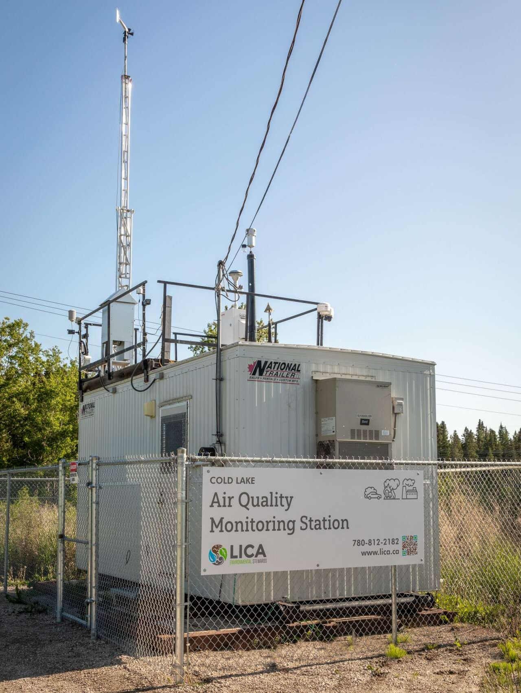[^1]
::: 

::: {.column .fragment width="69%"}
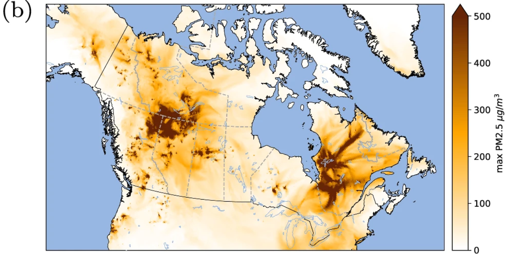[^2]

:::

::::

[^1]: Cold Lake, AB monitor. LICA (2026). https://lica.ca/airshed/regional-air-monitoring-programs/

[^2]: 2023 Wildfires PM~2.5~ Maxima. Jain et al. (2024). https://doi.org/10.1038/s41467-024-51154-7

::: {.notes}
- high upfront/maintenance cost
- a single point, may miss regional variations
- wildfire smoke is not concentrated in urban areas like many other sources
:::

## *Low-cost monitors* (PurpleAir, AQegg, etc) are a cost effective means to supplement monitoring

:::: {.columns}

::: {.column width="50%"}

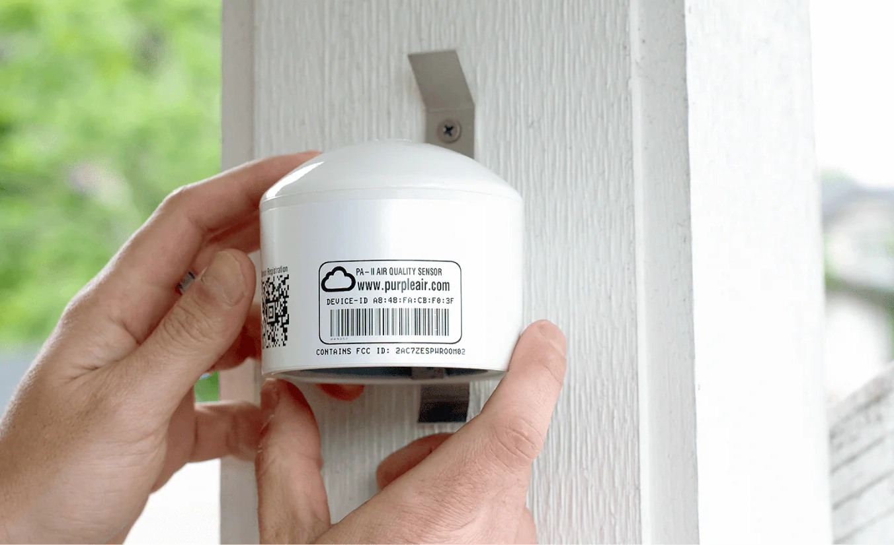[^3]

:::

::: {.column .incremental width="50%"}

- orders of magnitude cheaper to purchase (~$50k -> < $500)
- able to deploy without dedicated infrastructure
- accurate enough for detecting smoke events when bias-corrected[^4]

:::

::::

[^3]: https://www.purpleair.com/
[^4]: Nilson et al. (2022). https://doi.org/10.5194/amt-15-3315-2022

## It is difficult to determine individual access to monitoring data, but gaps do exist {auto-animate=true}

:::: {.columns}

::: {.column width="46%"}

::: {.r-stack}

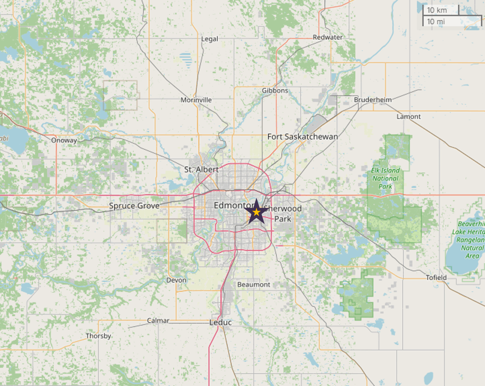{.fragment}

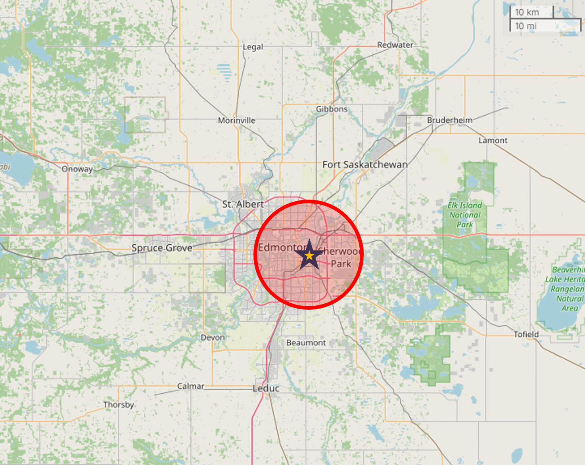{.fragment}

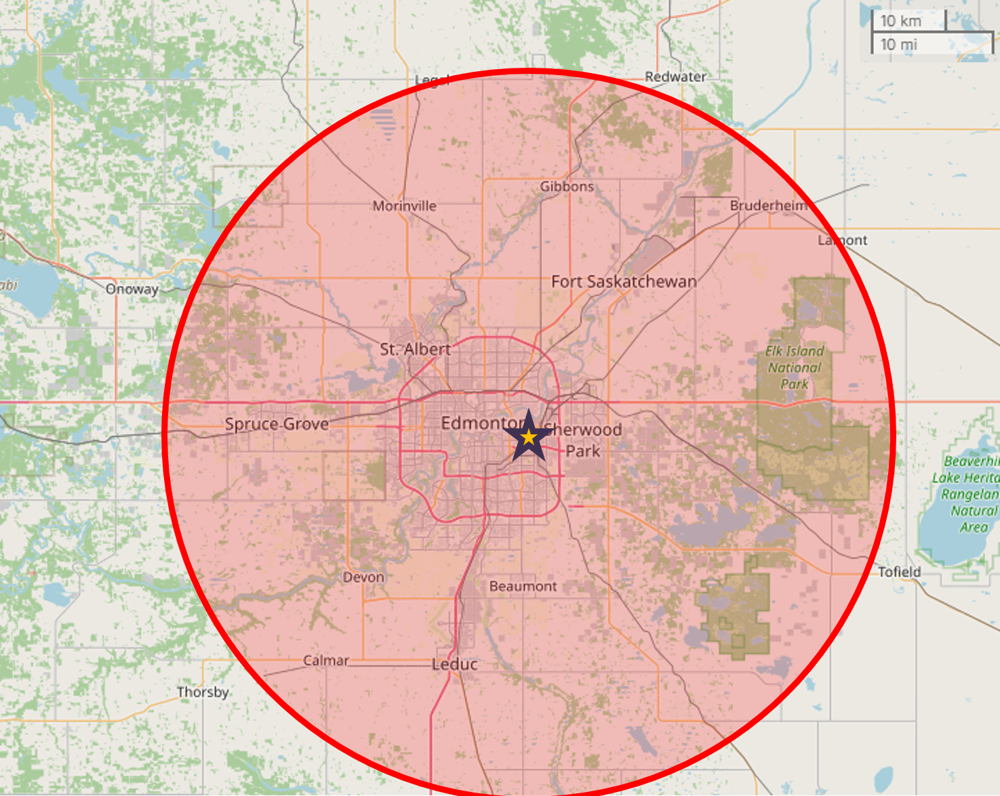{.fragment}

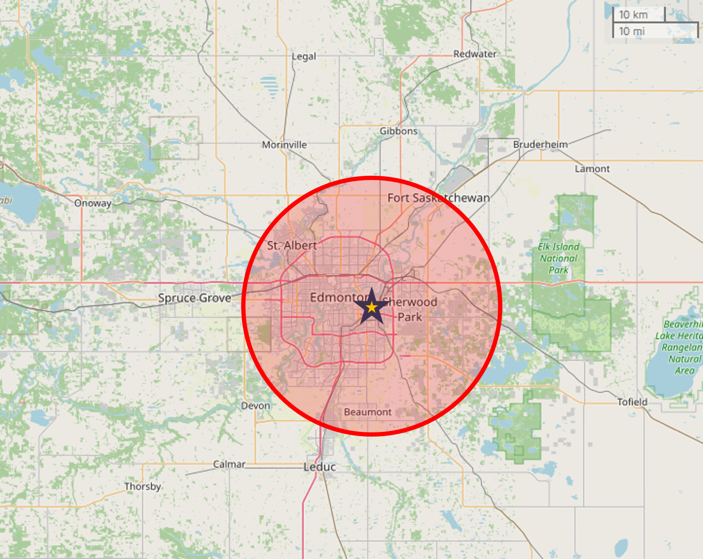{.fragment}

:::

:::

::: {.column .fragment width="54%"}

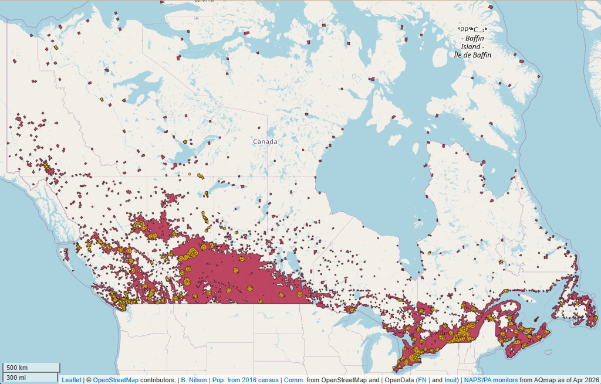[^5]

:::

[^5]: Nilson (2026). *Canadian PM2.5 Monitoring Gap Analysis: 2026-05-01*

::::

::: {.notes}
- Who needs access?
- What maximum distance to a monitor do we want?
- Is it possible to reasonably cover everyone?
:::

## {auto-animate=true}

{.center}

# Input Data

## Identified who needs access using community locations and gridded Census population

::::: {.columns}

:::: {.column width="50%"}
::: {.r-stack}

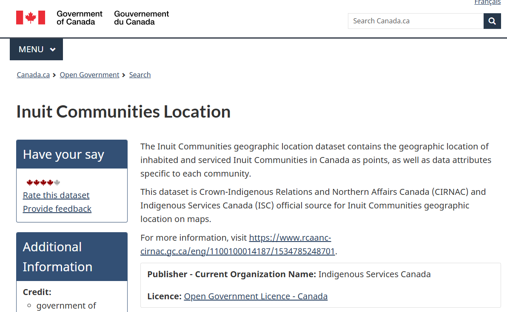{.fragment}

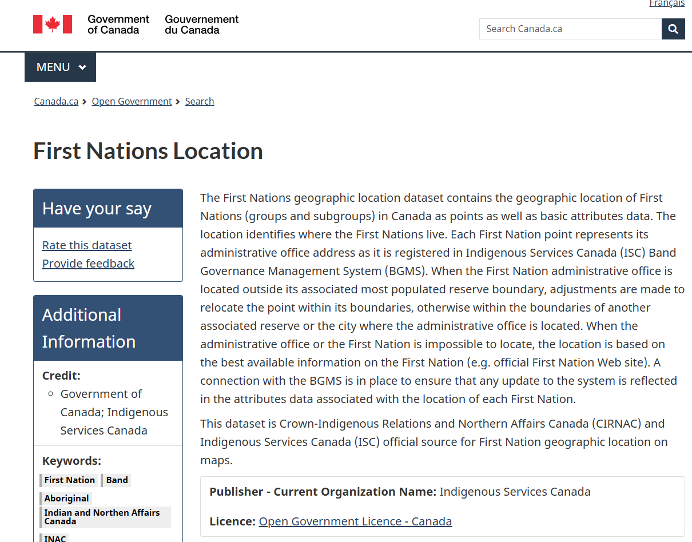{.fragment}

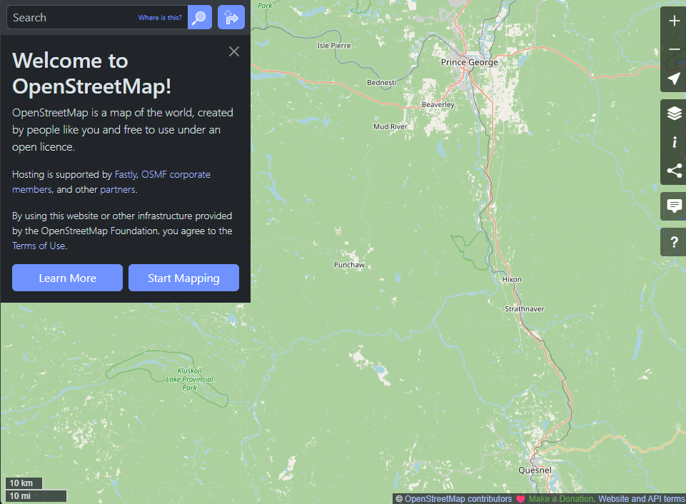{.fragment}
:::
::::

:::: {.column width="50%"}
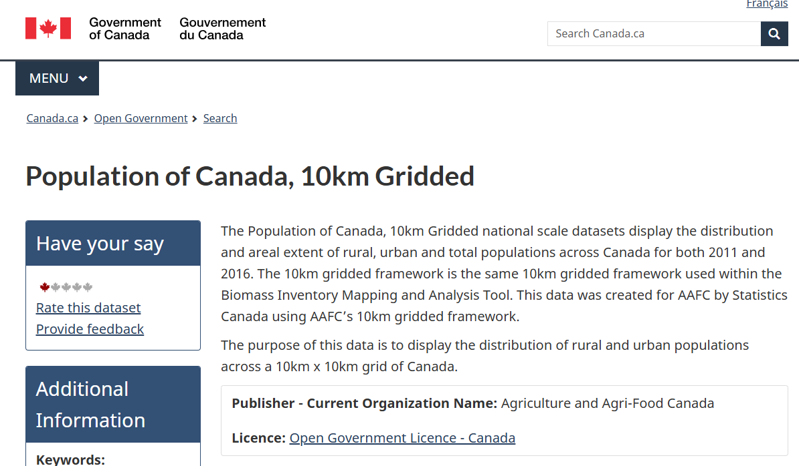{.fragment}

::: {.fragment}
*2016 Census used -- lack of 2021 gridded data*
:::
::::

:::::

## Considered existing regulatory (*NAPS FEM*) and PurpleAir monitors with PM~2.5~ data


 <!-- required 1+ observations during month of analysis (May 2026 here) -->

## Assumed possible to install a new monitor at any community (*not always true!*)

:::{.fragment}
>*Which communities could a monitor be installed in, such that someone without a monitor within 25 km would now be covered?*
:::

::: {.fragment}
Need:
:::

::: {.incremental}

(@) A host (i.e. community member, local government, schools, etc)
(@) Wi-Fi (may not be available/reliable, in range, or allowed on some networks)
(@) Power (ex. my home only has one exterior plug, limiting install)
(@) Space (a monitor under a covered patio beside a BBQ is not very useful!)

:::

## People, places, and PM~2.5~ monitors differ across provinces and territories

<!-- maybe cache a copy so stays static? -->



## The existing monitoring networks cover ~92% of Canadians, but only ~60% of communities

<!-- maybe cache a copy so stays static? or derive numbers from within table html -->



# Suggested Install Locations

## I suggest potential communities where a monitor could be installed to cover gaps

<!-- maybe cache a copy so stays static? -->



## Suggested installations and existing coverage can be viewed interactively
<!-- maybe cache a copy so stays static? -->



## Installations would occur in stages and can be targeted to meet access goals



# Conclusion

## This analysis provides guidance for network managers to improve access to PM~2.5~ monitoring

:::: {.columns}

::: {.column .fragment width="25%"}

```{mermaid}
flowchart
  A(Decide Access Goals) --> B(Check Gap Analysis)
  B <--> C(Identify Feasible Locations)
  D(Find Willing Host) <--> C
  B <--> D
  C --> E("Purchase Monitor(s)")
  E --> F("Install Monitor(s)")
  F --> A
```

:::

::: {.column width="75%"}

| 

:::{.fragment}
Questions? Want access to the automated report?
:::

:::{.fragment}
>  brayden.nilson@ec.gc.ca
:::

| 
| 

:::{.fragment}
Interested in performing a similar analysis? See:
:::

:::{.incremental}
- this presentation: <https://b-nilson.github.io/pm25_gap_analysis_presentation/>
- gapfinder R package: <https://github.com/B-Nilson/gapfinder>
- canadata R package: <https://github.com/B-Nilson/canadata>
:::

:::

::::


<!-- ask nunavut naps managers about PAs installed by env mgmt as well as epd? -->